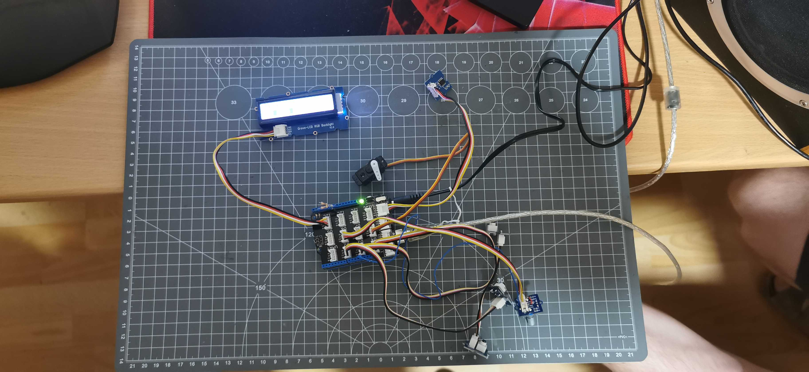

# avr-thermostat-cpp

[](https://github.com/HCDani/avr-thermostat-cpp/actions/workflows/ci.yml)

A closed-loop thermostat for an ATmega328P (Arduino Uno), written in C++14
directly against the registers with no framework underneath. A thermistor is
sampled through the ADC, the reading drives a hysteresis controller, and the
controller switches its output through the `IRelay` interface.

Hardware is a Grove Starter Kit v3: NTC on A0, relay as the pump output,
encoder for the setpoint, buttons, RGB LCD and a servo.
`Documentation/avr_thermostat.md` is the goal, not a description of what
already runs.

## Why C++ on a part with 2 KB of SRAM

Not for the language's sake. Each of these earns its place:

- **Every driver is an abstract interface, and the test mocks implement the
  same interface.** `Controller` holds an `ITemperature&` and an `IRelay&`,
  so the identical control logic runs against registers on the target and
  against mocks on the host, and contains no `#ifdef`. That costs a vtable per
  interface plus the `operator delete` stub in `src/cxx_runtime.cpp` that a
  virtual destructor drags in on a part with no C++ runtime.
- **`DeciCelsius` is a distinct type.** A raw ADC count cannot be compared
  against a setpoint by accident.
- **Temperatures are fixed point in tenths of a degree.** The 328P has no
  floating point unit, and 0.1 °C is already finer than the sensor's 1.5 °C
  accuracy.
- **The lookup table stays in flash.** AVR is a Harvard machine, so a const
  array in the default section is copied into SRAM at startup. `Progmem.h`
  keeps it in flash on the target and compiles down to a plain subscript on
  the host.
- **Compile-time constants are `constexpr`**, so the table geometry and the
  validity window cost nothing at runtime.

Built as C++14 rather than C++17 because PlatformIO ships g++ 5.1 for host
builds and avr-g++ 7.3 for the target, and 14 is the highest standard both
accept.

## Failing safe

The thermistor sits in a divider, so both ADC rails are electrically
meaningless: 0 claims infinite resistance, 1023 claims zero. Counts outside
24..992 (the window where the sensor is specified, −40 to 125 °C) are a
broken sensor rather than a temperature: below the window is an open lead,
above it a short. A single bad sample is tolerated as noise; enough
consecutive ones cut the relay and latch a fault.

The setpoints live in the first two EEPROM bytes, and the pair has to be
within 0..60 °C with tlow below thigh. Both sides of the store check that, and
they answer a failure differently. A read substitutes the defaults 18 and 25,
because the application has to start somewhere and a blank cell reads `0xFF`,
which is what a new board gives rather than an error. A save cancels: nothing
written, nothing changed, the same outcome as the encoder's long press. The
stored pair was already usable, so there is nothing to substitute and no
reason to spend one of the cell's finite erase cycles.

`temp::convert()` is the one place where that mapping happens. Host tests
exercise it; the ISRs never do.

## Layout

Headers are contracts and `.cpp` files are implementations. Libraries are
flat: PlatformIO's include root is the library folder, so sources include
`"Adc.h"`, not `"hal/Adc.h"`. One driver per library, each with its
interface, its hardware implementation and its mock.

```
lib/adc/          Adc.h .cpp              interrupt-driven ADC, AVR-free header
lib/temp/         ITemperature.h          driver interface
                  temp_hw.h .cpp          NTC through the ADC: latch + available()
                  mock_temp.h .cpp        test mock
                  Conversion.h .cpp       count -> Reading (status + DeciCelsius)
                  DeciCelsius.h           tenths of a degree
                  ThermistorTable.h .cpp  generated lookup
                  Progmem.h               flash access on AVR, subscript on host
lib/timer/        ITimer.h                1 Hz system tick
                  timer_hw.h .cpp         Timer 0, CTC, /1024, divide by 125
                  mock_timer.h .cpp       ticks on demand
lib/relay/        IRelay.h                relay interface
                  mock_relay.h .cpp       test mock
                  relay_hw.h .cpp         GPIO driver for relay
lib/usart/        IUsart.h                polled TX
                  usart_hw.h .cpp         USART0, 115200 8N1
                  usart_c.h               C API for Unity
                  mock_usart.h .cpp       test mock
lib/twi/          Twi.h .cpp              blocking I2C master
lib/lcd/          ILcd.h                  16x2 text; used by led and display
                  lcd_hw.h .cpp           Grove LCD RGB Backlight over TWI
                  mock_lcd.h .cpp         2x16 write buffer
lib/led/          ILed.h                  status cells on LCD row 2
                  led_hw.h .cpp           CGRAM block / space; talks only to ILcd
                  mock_led.h .cpp         test mock
lib/display/      IDisplay.h              numeric display on LCD row 1
                  display_hw.h .cpp       TEMP / TLOW / THIGH and whole degrees
                  mock_display.h .cpp     test mock
lib/key/          IKey.h                  Grove buttons 1..3
                  key_hw.h .cpp           D2/D3/D4, debounce >= 20 ms
                  mock_key.h .cpp         test mock
lib/encoder/      IEncoder.h              D6/D7 quadrature, D12 SW active low
                  encoder_hw.h .cpp       PCINT2; 4 transitions per detent
                  mock_encoder.h .cpp     test mock
lib/servo/        IServo.h                0..180 deg
                  servo_hw.h .cpp         Timer 1 OC1A D9, 50 Hz
                  mock_servo.h .cpp       test mock
lib/settings/     ISettings.h             persisted setpoints, whole degrees
                  Sanitize.h .cpp         the pair rule: read substitutes, save cancels
                  settings_hw.h .cpp      EEPROM bytes 0 and 1; update, not write
                  mock_settings.h .cpp    RAM store, counts erase cycles
lib/controller/   Controller.h .cpp       hysteresis; onTick vs service
lib/logic/        Demo.h .cpp             Part 1.3 key states then AND/OR/XOR/NAND/NOR/XNOR
lib/thermo/       Thermometer.h .cpp      Part 2+3: bar 21–28 C
lib/solar/        Solar.h .cpp            Part 4: valve/pump hysteresis, setpoints
src/              main.cpp, cxx_runtime.cpp
test/             Unity host suites; unity_config.h for the Uno
tools/            table generator
```

`DeciCelsius.h` and `Progmem.h` keep their bodies in the header because
`constexpr` and `inline` require the definition at the point of use.
Everything else is declared in a header and defined in a `.cpp`.

## Building and testing

Host tests need a C++ compiler on `PATH`. PlatformIO ships one, so on Windows:

```powershell
$env:PATH = "$env:USERPROFILE\.platformio\packages\toolchain-gccmingw32\bin;$env:PATH"
pio test -e native
```

Building the firmware needs no host compiler, only the AVR toolchain that
PlatformIO fetches for the board:

```powershell
pio run -e uno
```

On-target Unity, uploaded over COM9, reports through USART0 at 115200:

```powershell
pio test -e uno
```

That command flashes the board.

Regenerating the lookup table, after changing the thermistor parameters:

```
python tools/gen_thermistor_table.py
```

The script prints reference values that the host tests assert against, so the
table and the tests cannot drift apart silently. `ThermistorTable.h` and
`ThermistorTable.cpp` are generated; do not edit them by hand.

## Continuous integration

Every push to `main` and every pull request runs two jobs:

- the host test suites, and
- a check that regenerating the lookup table produces no diff, so the table
  cannot be edited by hand and drift away from the script that owns it.

Neither job builds the firmware, so `pio run -e uno` and `pio test -e uno`
are local checks.

## Status

`Documentation/avr_thermostat.md` is the target; this is how far it has got.

Done and covered by host tests: conversion (`convert()` plus the generated
table), the hysteresis controller, the temperature, timer, relay and USART
interfaces with their mocks, and Part 1 (LCD status row, Grove keys, logic
demo). The interrupt-driven ADC, the 1 Hz Timer 0 tick, USART0 and a blocking
TWI master are written. Firmware currently runs Part 4: panel temperature
with tlow/thigh hysteresis, servo valve on D9, pump on row-2 position 7,
keys for TEMP/TLOW/THIGH, encoder on D6/D7, switch on D12 (active low), and
setpoints in EEPROM through `ISettings` — written only on the encoder's
short-press commit, never per tick.

Timers are allocated for the whole design. Timer 1 is the servo: hardware PWM
on `OC1A` (D9, white of Grove port D8). The encoder is D6/D7, switch on D12.
Timer 2 is unused. The tick is Timer 0 in CTC, divided by 125 in software.

Neither interrupt does arithmetic. The tick starts a conversion; the ADC
completion interrupt latches the count and sets `available()`; interpolation
runs in the main loop via `ITemperature::get()`. `Controller` is split the
same way: `onTick()` in interrupt context, `service()` in the loop. The Part 1
demo has no ISR of its own: keys are polled and I2C runs in the main loop.
`Thermometer` is split like `Controller`. `Solar` is the same split: `onTick()`
starts a conversion and marks a display refresh; `service()` reads keys and
the encoder, decides valve/pump, and writes the LCD.

## Hardware

The finished board: Grove Base Shield 2.0 on an Uno, NTC, three buttons,
encoder, LCD, and servo, running Part 4.


